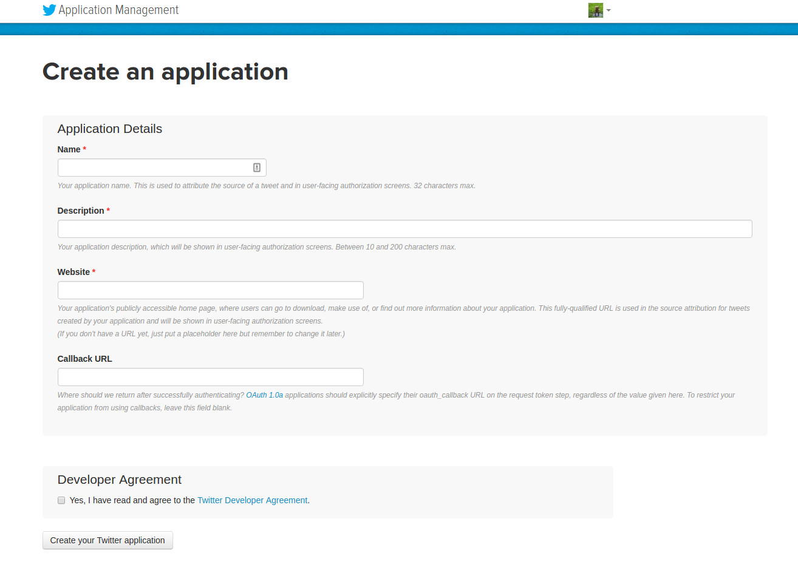
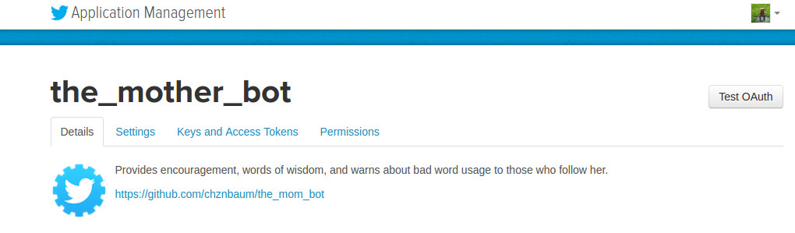

# Mom Bot
A Twitter Bot, [Mom Bot](https://twitter.com/the_mother_bot), that provides encouragement and warns about bad word usage to those who follow her.

## Installation
To install this project to make your own Twitter Bot:

1. Click the "Fork" button to create your own repository.
2. From your forked repository, clone or download the the repository to your local system.
3. Go to [Twitter](https://twitter.com) and create a separate Twitter account for your bot. You will need to include a mobile phone number on this account, but you can remove the number after completing these installation steps.
4. Go to [Twitter Dev](https://dev.twitter.com) and click on "Manage Your Apps" (in the footer). Sign in as your bot and click "Create New App".
5. Enter a name and description for your bot, as well as a website, which can be a link to your bot repository on GitHub. Read the Twitter Developer Agreement and check it off, then click "Create your Twitter application". 
6. When your Twitter app pulls up, switch to the "Keys and Access Tokens" tab. Make note of the Consumer Key (API Key) and Consumer Secret (API Secret). Under "Your Access Token", click to generate your Access Token and Access Token Secret. If your bot is ever compromised, you will want to regenerate these keys as well as the Consumer Key and Secret. 
7. Create a `config.js` file in the root of this project's directory. Insert your bot account's Twitter API keys like this:

    ```javascript
    module.exports = {
   	 consumer_key:				'...',
   	 consumer_secret:			'...',
   	 access_token:				'...',
   	 access_token_secret:		'...'
    }
    ```

8. Because the `config.js` file has your authentication keys within it, make sure it is in your `.gitignore` file. This can be done from your terminal like this:

    ```bash
    echo config.js >> .gitignore
    ```

9. In the `bot.js` file, change the `bot_name` variable value to your bot's name (like Mom Bot), the `bot_screen_name` variable value to your bot's Twitter handle, and the `bot_owner_name` variable value to your own primary Twitter handle.
10. Create a [Heroku](https://heroku.com) account if you don't already have one. In your dashboard, create a new app, calling it whatever you like.
11. In your terminal, download the [Heroku CLI](https://devcenter.heroku.com/articles/heroku-command-line) if you haven't already. Log in to your account by entering the following into your terminal and following the prompts:

    ```bash
    heroku login
    ```

12. Connect your directory with your Heroku app:

    ```bash
    git init
    heroku git:remote -a YOUR-APP-NAME
    ```

13. Deploy your application to Heroku:

    ```bash
    git add .
    git commit -am "add project files"
    git push heroku master
    ```

14. By default, Heroku apps use [web dynos](https://devcenter.heroku.com/articles/dynos). A Procfile has been included to instruct a worker dyno to be used to run your app instead. As an extra precaution, you can correct the dynos used in your terminal like this:

    ```bash
    heroku ps:scale web=0 worker=1
    ```

15. You may need to restart your worker dyno in order to get your app up and running. Do that like this:

    ```bash
    heroku restart worker.1
    ```

16. A few additional tools to check on your app:

    ```bash
    heroku ps // Checks the status of your dynos
    heroku logs // Shows your app console, any errors and shutdowns/restarts
    ```

## Use

### Using the Existing Bot
To use the existing bot, a user can simply follow [Mom Bot](https://twitter.com/the_mother_bot) on Twitter. Mom Bot will respond to the follow request and follow the user back.

From there, Mom Bot will scan tweets in the stream for use of bad words. If a tweet contains a bad word, Mom Bot will respond with an @reply to the tweeter.

Mom Bot will also scan for @replies directed at Mom Bot. If a user tweets an @reply that includes a sad word, Mom Bot will tweet an @reply to the user to cheer them up. If a user tweets an @reply that includes a proud or happy word, Mom Bot will tweet an @reply to the user to express her pride in the user.

### Using a Custom Bot
Once your bot is installed, you can dig into the code to add or change functionality. This bot uses the `twit` NPM package to manipulate tweets and streams. Be sure to review the [documentation](https://github.com/ttezel/twit) for that project prior to making substantial changes.

## Contributing

### If You're Not Sure How to Do It
No worries. You can still help out by:
* Pointing out bugs/errors.
* Recommending cool features.

For either of these options, please create an issue so it can be addressed. New to GitHub issues? They have a pretty handy [guide](https://guides.github.com/features/issues/) you can use to familiarize yourself with them.

### If You Can Make the Change
Simply:
* Fork the repository
* Make your suggested change
* Make sure the code style looks similar to the existing code
* Create a pull request

## Credits
* Created by [Chazona Baum](https://github.com/chznbaum) as a personal project.
* Uses the [twit NPM package](https://www.npmjs.com/package/twit) to maniuplate tweets and streams.
* Uses the [badwords NPM package](https://npmjs.com/package/badwords) to provide its list of "bad words" (profanity) in English.
* Created after viewing the [Twitter Bot Tutorial Series](https://www.youtube.com/playlist?list=PLRqwX-V7Uu6atTSxoRiVnSuOn6JHnq2yV) provided by [Daniel Shiffman](http://shiffman.net). His Coding Rainbow series is so many shades of amazing. You should watch his [YouTube videos](https://www.youtube.com/channel/UCvjgXvBlbQiydffZU7m1_aw) and contribute on [Patreon](https://www.patreon.com/codingrainbow).

## License
MIT License

Copyright (c) 2016 Chazona Baum [chazona@chazonabaum.com](mailto:chazona@chazonabaum.com)

Permission is hereby granted, free of charge, to any person obtaining a copy
of this software and associated documentation files (the "Software"), to deal
in the Software without restriction, including without limitation the rights
to use, copy, modify, merge, publish, distribute, sublicense, and/or sell
copies of the Software, and to permit persons to whom the Software is
furnished to do so, subject to the following conditions:

The above copyright notice and this permission notice shall be included in all
copies or substantial portions of the Software.

THE SOFTWARE IS PROVIDED "AS IS", WITHOUT WARRANTY OF ANY KIND, EXPRESS OR
IMPLIED, INCLUDING BUT NOT LIMITED TO THE WARRANTIES OF MERCHANTABILITY,
FITNESS FOR A PARTICULAR PURPOSE AND NONINFRINGEMENT. IN NO EVENT SHALL THE
AUTHORS OR COPYRIGHT HOLDERS BE LIABLE FOR ANY CLAIM, DAMAGES OR OTHER
LIABILITY, WHETHER IN AN ACTION OF CONTRACT, TORT OR OTHERWISE, ARISING FROM,
OUT OF OR IN CONNECTION WITH THE SOFTWARE OR THE USE OR OTHER DEALINGS IN THE
SOFTWARE.

## Changelog

### 1.0.0
* Initial release